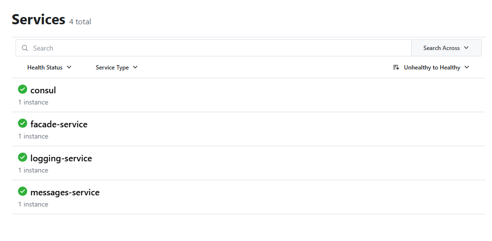
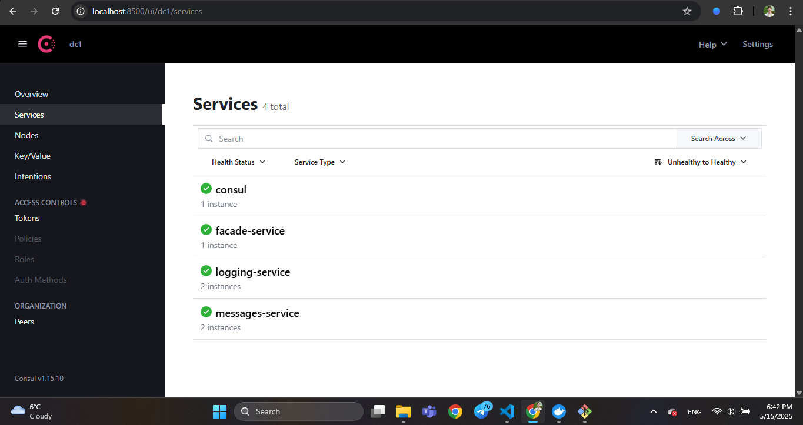
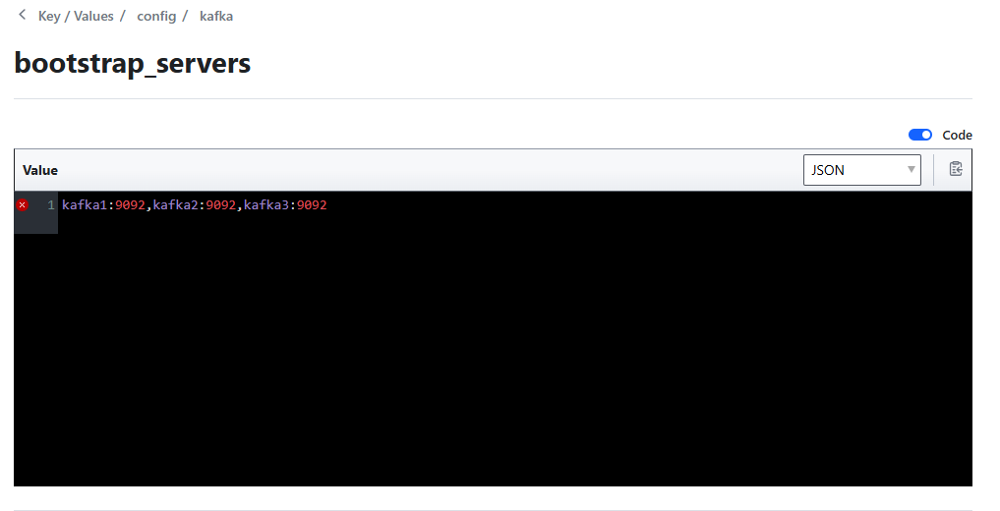
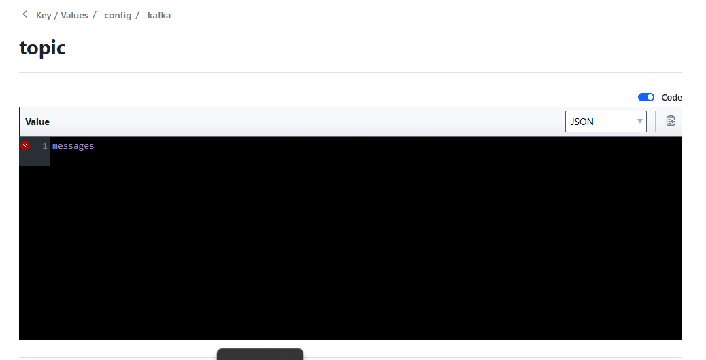
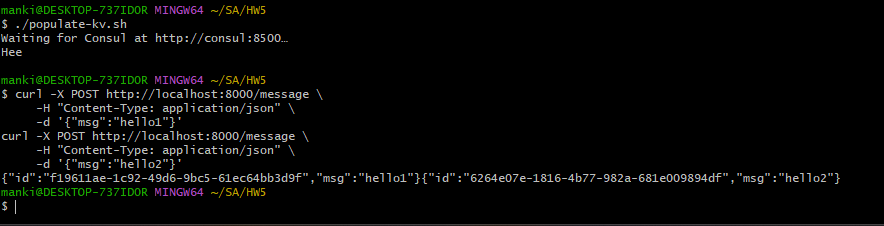
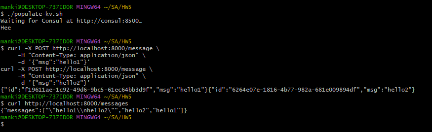
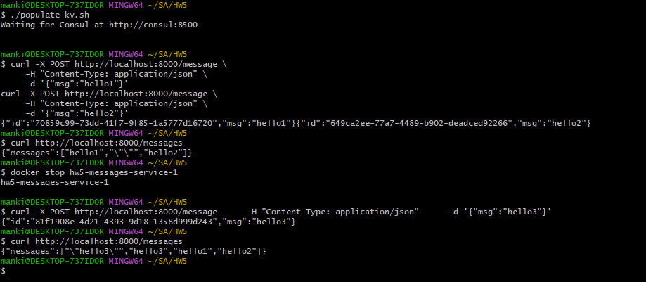
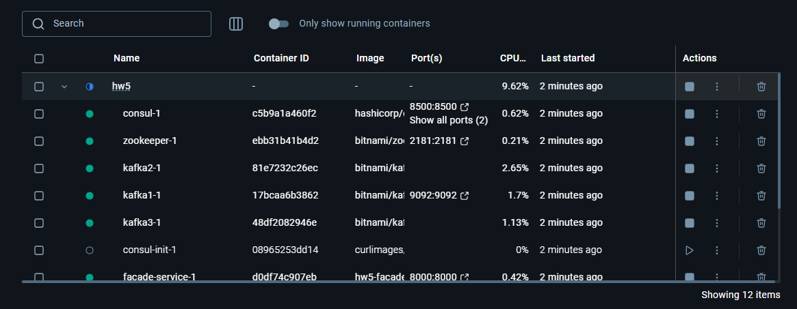
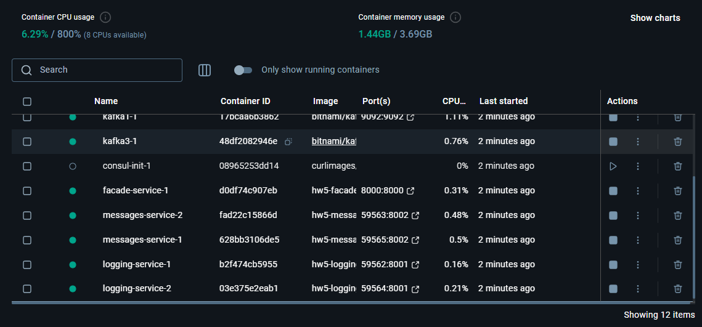

# Lab 5: Service discovery & config server with consul

У реалізації Lab 5, де до нашої системи з попередньої лабораторної додається Consul як Service Registry, Discovery та Config Server.  

Сервіси:
- **facade-service** — приймає HTTP POST/GET, звертається до logging-service і messages-service  
- **logging-service** — приймає логи через REST, реєструється в Consul  
- **messages-service** — споживає Kafka-повідомлення, зберігає їх у пам’яті, реєструється в Consul  
- **Consul** — реєструє всі сервіси + зберігає конфігурацію Kafka (bootstrap_servers, topic)  

---

## Prerequisites

- Docker & Docker Compose  
- `curl`  
- (опціонально) `bash` для запуску `populate-kv.sh`  

-----

## Запустити

1. **Очистка попередніх контейнерів та даних Consul**

   ```bash
   docker-compose down -v
   ```
2. **Запуск стека**

   ```bash
   docker-compose up -d --build \
     --scale facade-service=1 \
     --scale logging-service=2 \
     --scale messages-service=2
   ```






3. **Заповнення KV у Consul**

   ```bash
   chmod +x ./populate-kv.sh
   ./populate-kv.sh
   ```






----------

## Тестування

### 1. Перевірка запису в лог та в чергу

```bash
# відправляємо повідомлення через facade-service
curl -X POST http://localhost:8000/message \
  -H "Content-Type: application/json" \
  -d '{"msg":"hello1"}'

curl -X POST http://localhost:8000/message \
  -H "Content-Type: application/json" \
  -d '{"msg":"hello2"}'
```


### 2. Перевірка отримання всіх повідомлень

```bash
curl http://localhost:8000/messages
# Очікуємо JSON з messages-service і лога від logging-service
```


### 3. Симуляція відключення інстанції

```bash
# Зупиняємо одну копію messages-service
docker stop hw5-messages-service-1

# Відправляємо ще одне повідомлення
curl -X POST http://localhost:8000/message \
  -H "Content-Type: application/json" \
  -d '{"msg":"hello3"}'

# GET знову
curl http://localhost:8000/messages
```

Як бачимо, навіть після відключення однієї ноди, system працює:



* Consul показує 1 інстанцію messages-service зі статусом Critical/Warning
* facade-service читає з другої живої інстанції
* жодне повідомлення не губиться

---

## Скріншоти

ось ще декілька зображень із контейнерами:





