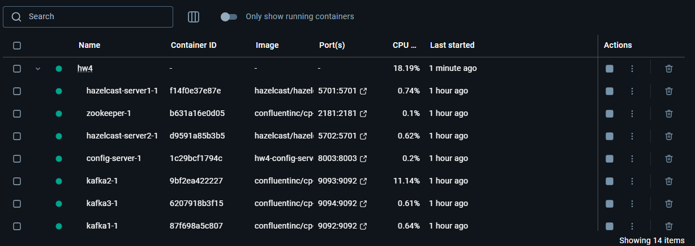
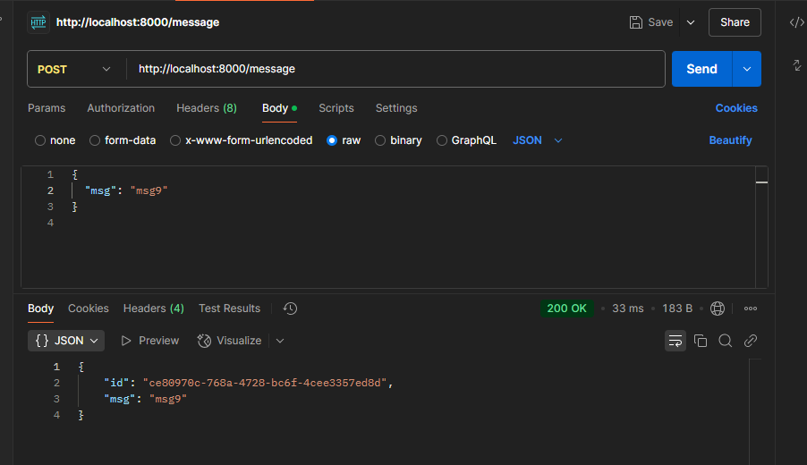
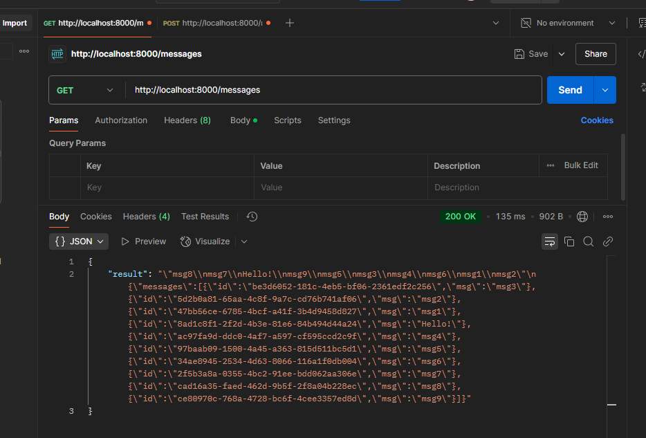
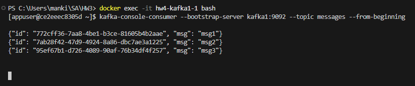

# Lab 4 – Microservices with messaging queue (Kafka)

This project extends the functionality developed in the previous assignment and implements a microservice system with a messaging queue.  
In this lab, Kafka is used as the messaging channel (10 points). The system components are:

- **config-server:** A central registry that returns the endpoints of the microservices.
- **facade-service:** A facade for client interactions – it receives HTTP POST and GET requests and routes them accordingly.
  - On a POST request, it sends the message to both logging-service and Kafka (via a Kafka Producer).
  - On a GET request, it queries both logging‑service and messages‑service and aggregates the responses.
- **logging-service:** Uses Hazelcast Distributed Map (deployed with 3 scaled instances) to store messages
- **messages-service:** Consists of 2 scaled instances. Each instance operates as a Kafka Consumer (with its own unique consumer group) and stores all messages from the Kafka topic in local memory.
- **Kafka Cluster & Zookeeper:** A Kafka cluster with 3 brokers is deployed, together with Zookeeper, to ensure message replication and fault tolerance.
- **Hazelcast Servers:** Two Hazelcast server containers are deployed for logging-service connectivity

## Overview

- **Client Interaction:**  
  Clients send HTTP POST requests (for example, via curl or Postman) to facade-service at `http://localhost:8000/message` with JSON body:
  ```json
  { "msg": "msg1" }
  ```
  Ten messages (e.g. msg1, msg2, …, msg10) are sent.

- **Message Delivery:**  
  - Upon receiving a POST request, facade-service forwards the message to logging-service and also sends it to Kafka (topic "messages").
  - logging-service stores messages in its Hazelcast Distributed Map.
  - messages-service acts as a Kafka Consumer, reading all messages from the topic and saving them locally

- **GET Request Aggregation:**  
  A GET request to `http://localhost:8000/messages` returns an aggregated response containing:
  - The messages stored by logging-service (as a string, e.g. `"msg3\nmsg1\nmsg2"`).
  - The messages consumed by messages-service (as a JSON array)

- **Fault Tolerance Testing:**  
  The Kafka cluster is configured with 3 brokers and Zookeeper, ensuring that if one broker (for instance, the leader) fails, messages remain available from its replicas. The design also allows testing that if messages-service instances are temporarily not running, messages accumulate in the queue and are delivered upon their restart

## Setup and Deployment

1. **Prerequisites:**
   - Docker and Docker Compose must be installed
   - Clone this repository

2. **Starting the System:**

   From the project root directory, run:
   ```bash
   docker-compose down
   docker-compose up --build --scale logging-service=3 --scale messages-service=2
   ```
   This command starts the following containers:
   - **facade-service:** Exposed on port 8000.
   - **logging-service:** 3 instances (internal communication only).
   - **messages-service:** 2 instances.
   - **config-server:** Exposed on port 8003.
   - **Zookeeper:** Exposed on port 2181.
   - **Kafka Brokers:** 3 brokers exposed on ports 9092, 9093, and 9094 respectively.
   - **Hazelcast Servers:** Two servers for logging-service connectivity.

## Testing

### 1. Verify Kafka Topology
- **Kafka Console Consumer:**  
  From one Kafka container (e.g., kafka1), execute:
  ```bash
  docker exec -it hw4-kafka1-1 bash
  kafka-console-consumer --bootstrap-server kafka1:9092 --topic messages --from-beginning
  ```
  You should see messages (e.g., msg1, msg2, msg3…) confirming that Kafka receives messages.

### 2. POST Requests
- **Using Postman or curl:**  
  Send HTTP POST requests to:
  ```
  http://localhost:8000/message
  ```
  with a JSON body, for example:
  ```json
  { "msg": "msg1" }
  ```
  Do this for 10 messages (msg1, msg2, …, msg10).  
  Each request should return a JSON response with a unique id and the sent message.

### 3. GET Request
- **Using Postman or curl:**  
  Send a GET request to:
  ```
  http://localhost:8000/messages
  ```
  The returned response should aggregate:
  - A string of messages from logging‑service (e.g., `"msg3\nmsg1\nmsg2"`).
  - A JSON object from messages‑service, which now (thanks to each instance having a unique consumer group) contains all consumed messages:
    ```json
    { "messages": [ {"id": "...", "msg": "msg1"}, {"id": "...", "msg": "msg2"}, ... ] }
    ```

### 4. Check Container Logs
- **logging-service logs:**  
  Confirm that each instance logs the receipt of messages.
- **messages-service logs:**  
  Execute:
  ```bash
  docker logs hw4-messages-service-1
  docker logs hw4-messages-service-2
  ```
  Look for lines like:
  ```
  Consumed message: { "id": "...", "msg": "msg1" }
  ```
- **facade-service logs:**  
  Ensure that Producer successfully sends messages to Kafka.

### 5. Fault Tolerance Testing
- **Stop one Kafka broker or simulate failure:**  
  For example, stop the leader broker and resend messages. Verify via Kafka console consumer and messages-service logs that messages are not lost.
- **Stop messages-service instances:**  
  Stop both copies temporarily to let messages accumulate in Kafka; then restart messages-service and verify that they receive all messages.

## Screenshots

### 1. Screenshot of Running Containers



### 2. Screenshot of a POST Request with the Last Message (e.g., msg10)


### 3. Screenshot of a GET Request Result Aggregating Messages


### 4. Screenshot of sended messages to kafka1



## Conclusion

This implementation satisfies all the requirements:

- **Messaging queue:** Kafka is used as the messaging channel between facade‑service and messages‑service.
- **Scalability:** 3 instances of logging‑service and 2 instances of messages‑service are deployed.
- **Dynamic routing:** facade‑service retrieves endpoints dynamically from config‑server.
- **Fault tolerance:** The Kafka cluster with 3 brokers and proper replication ensures messages are not lost if a broker fails.
- **Aggregate response:** GET requests return combined data from logging‑service (via Hazelcast) and messages‑service (via Kafka consumer).

**GitHub Repository:**  
[GitHub Repository Link](https://github.com/vbronetskyi/Software-architecture/tree/micro_mq)
