# Hazelcast Tests Report

by Volodymyr Bronetskyi

This repository contains a series of scripts that demonstrate the capabilities of Hazelcast for distributed data structures and synchronization mechanisms.

## Test Scripts

### Connection Test

- **Script:** `test_connection.py`
- Tests the initial connection to the Hazelcast cluster.

**./hz-start.bat:**

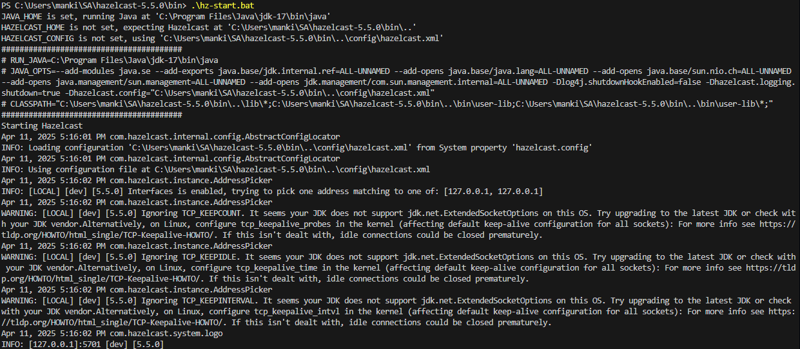

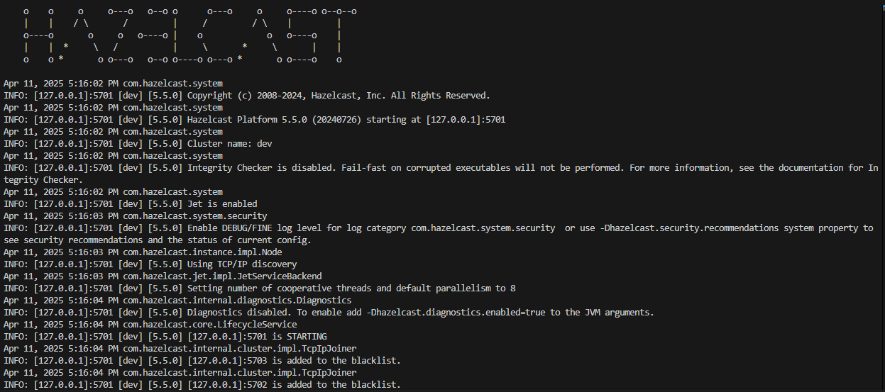

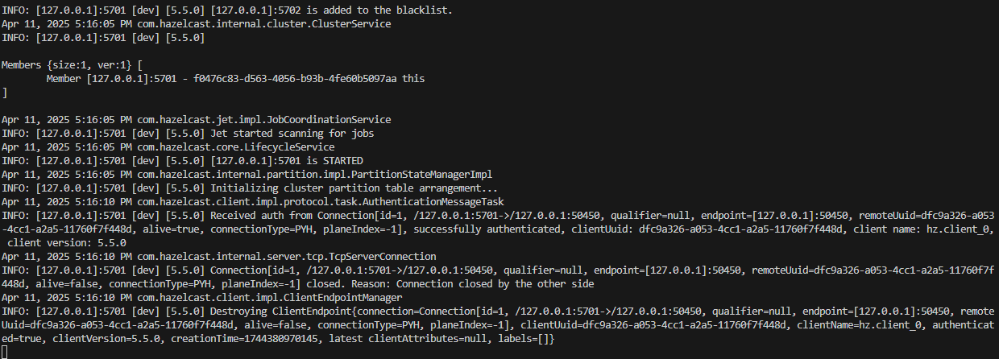

**hazelcast-management-center problems with windows:**

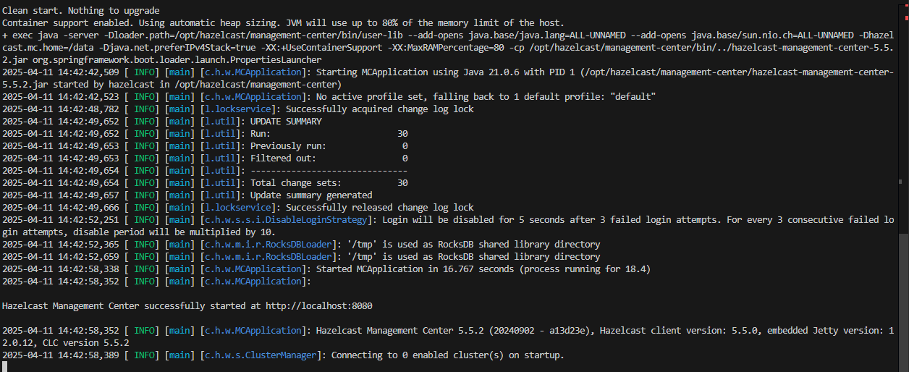

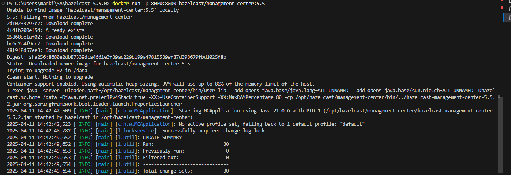

**I spent 6 hours, but I still couldn't fix the problem, so I wrote a script to check the distribution of keys on the node in the cluster:**

### Key Distribution by Nodes

- **Script:** `keys_by_nodes.py`
- Visualizes the distribution of keys across different cluster nodes after various operations.

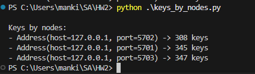

### Distributed Map Test

- **Script:** `test_distributed_map.py`
- Demonstrates the usage of Hazelcast Distributed Map and checks the distribution of keys across the cluster.

### Increment Without Lock

- **Script:** `test_increment_no_lock.py`
- Tests the increment operation on a shared counter without any locking mechanism to demonstrate race conditions.

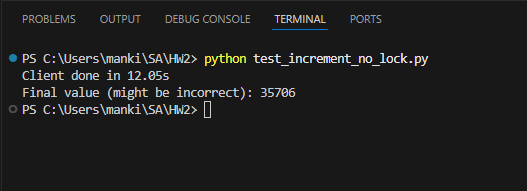

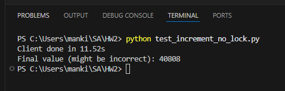

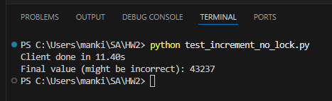

(forgot clean previous)

### Increment with Pessimistic Lock

- **Script:** `test_increment_pessimistic.py`
- Uses a pessimistic locking mechanism to safely increment a shared counter.

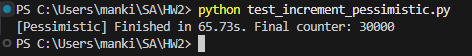

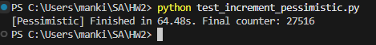

### Increment with optimistic lock

- **Script:** `test_increment_optimistic.py`
- Demonstrates the use of optimistic locking (using compare-and-swap) for incrementing a shared counter.

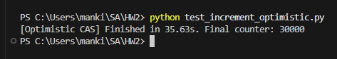

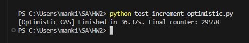

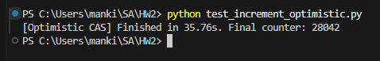

(all - 30000, but i start in three different terminals sequentially so slightly smaller values ​​in the following)

### Compare Locking Mechanisms

- **Script:** `test_compare_locking.py`
- Compares the effectiveness and efficiency of no lock, pessimistic, and optimistic locking strategies.

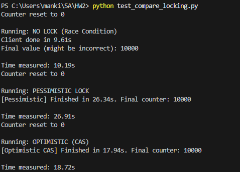

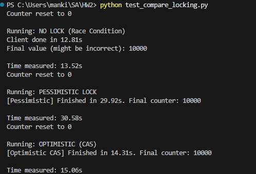

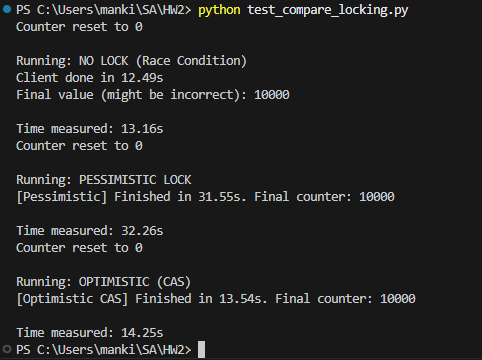

### Bounded Queue Test

- **Script:** `test_bounded_queue.py`
- Demonstrates the use of a Hazelcast Bounded Queue with multiple producers and consumers.

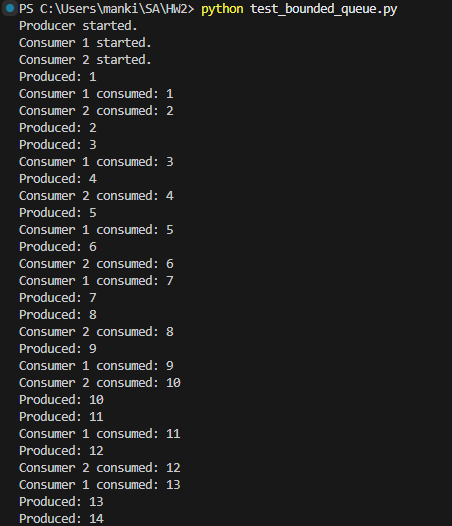

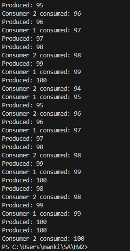

## Results

The tests illustrate various aspects of Hazelcast's distributed data structures and synchronization mechanisms. Detailed results are shown in the screenshots linked above for each script.

## Conclusion

These scripts provide a practical demonstration of Hazelcast's capabilities for handling distributed data structures and ensuring data consistency across a distributed system.

Repo link:

