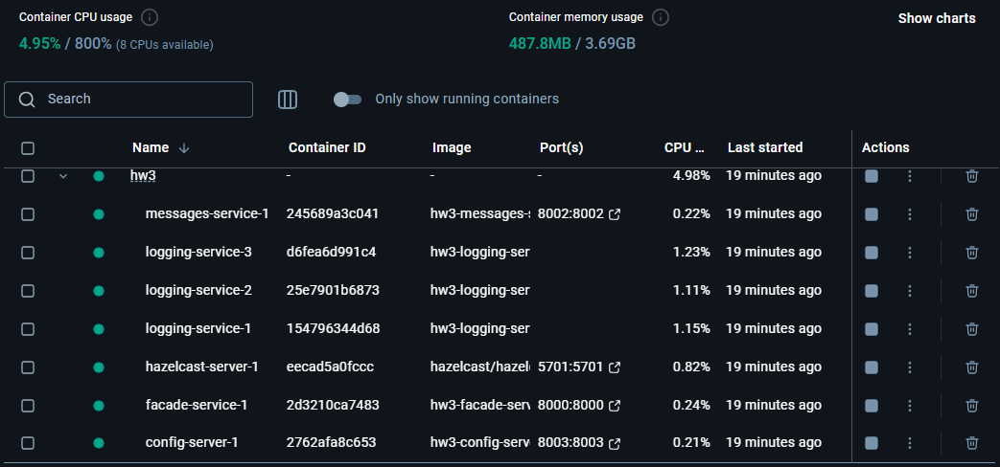
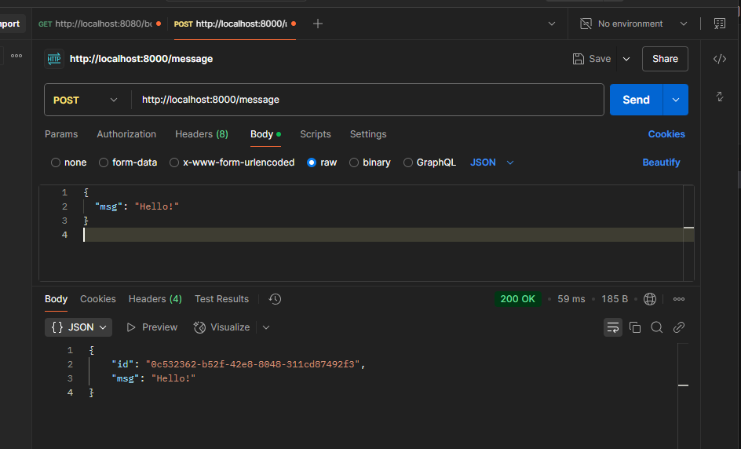
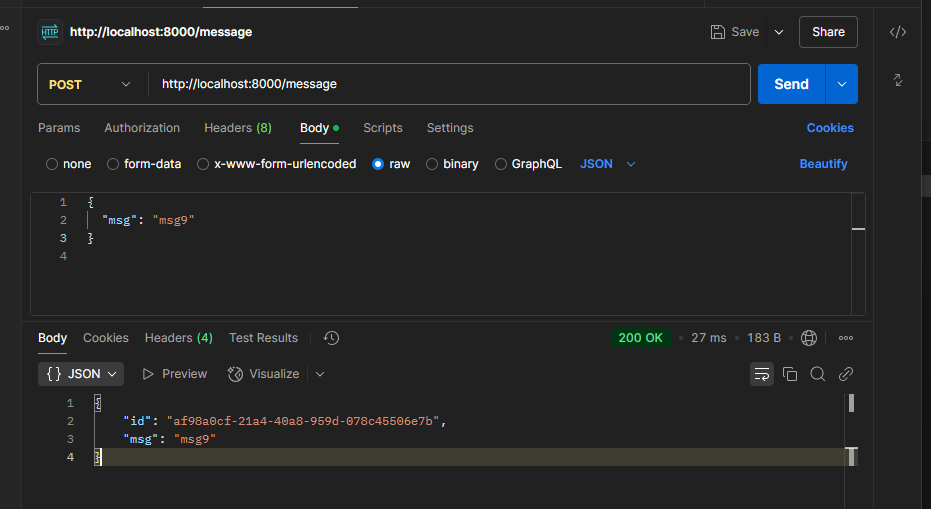
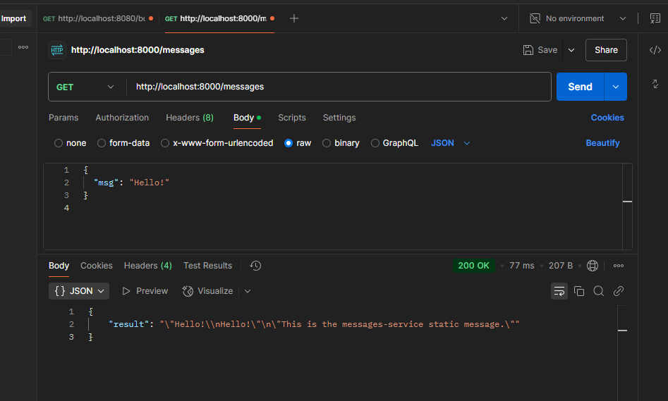
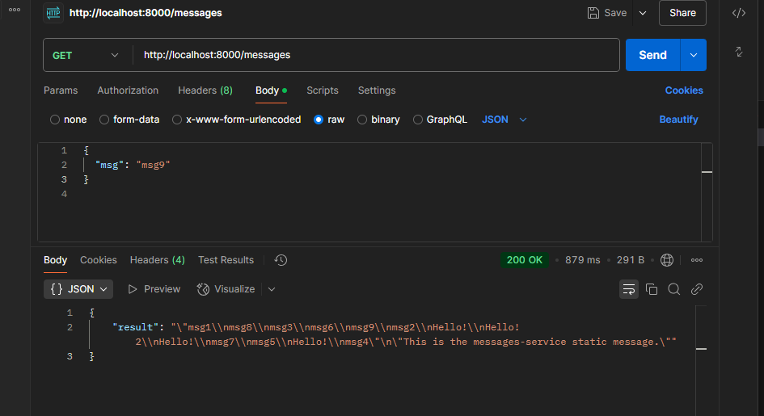

# Microservices with Hazelcast Distributed Map

This project implements a microservices architecture using a Hazelcast Distributed Map for message storage. The project builds on the previous assignment and includes additional functionality as specified in the task description

## Overview

### Base Functionality (5 points)
- **Client Interaction:** client interacts with the facade-service via HTTP POST and GET requests (using curl, Postman, or a browser in dev mode)
- **Logging-Service with Hazelcast:** instead of using a local hash table, the logging-service stores messages in a Hazelcast Distributed Map.
- **Scalability:** multiple instances of the logging-service can be run simultaneously (by scaling via Docker Compose).
- **Dynamic Routing:** the facade-service randomly selects one of the available logging-service instances (via config-server) for processing POST/GET requests. In case the selected instance is unavailable, the service retries with an alternative instance

### Additional functionality (+5 points)
- **Config Server as a Service Registry:**  
  Service endpoint information is centralized in a separate microservice called config-server.  
- **Dynamic Service Discovery:**  
  Before sending requests to the logging-service or messages-service, the facade-service queries the config-server to retrieve the current list of service endpoints
- **Flexible Deployment:**  
  This approach ensures that if the IP addresses/ports change (via dynamic allocation or scaling), the facade-service can still determine the correct endpoints without changes in its code

All source code is stored in a single GitHub repository under the branch `micro_hazelcast` and is deployed using Docker Compose. The system consists of the following microservices:

- **config-server** – centralized registry that holds the service endpoints
- **facade-service** – facade that receives client requests and forwards them to the respective services.
- **logging-service** – service that stores messages using a Hazelcast Distributed Map. Multiple instances of this service are scaled via Docker compose
- **messages-service** – service that returns a static message
- **hazelcast-server** – official hazelcast container that provides the Hazelcast cluster for message storage

## Setup and Deployment

1. **Prerequisites:**
   - Docker and Docker Compose must be installed
   - Clone the repository and navigate to the project root

2. **Deployment:**
   Run the following commands to rebuild the images and start the system with scaling (3 instances of logging-service):
   ```bash
   docker-compose down
   docker-compose up --build --scale logging-service=3
   ```
   This command starts all services, including the hazelcast-server

3. **Testing the API:**
   - **POST /message:**  
     Send HTTP POST requests to `http://localhost:8000/message` with a JSON body. For example, to send a message:
     ```json
     { "msg": "msg1" }
     ```
     Send 10 different messages (msg1, msg2, …, msg10). For instance, the last message should contain `"msg9"`

   - **GET /messages:**  
     Send a GET request to `http://localhost:8000/messages`. The facade-service should return the aggregated messages stored by logging-service along with the static message from messages-service

4. **Fault Tolerance Testing:**
   - Stop one or more of the logging-service containers (using `docker stop hw3-logging-service-2`) and perform a GET request to ensure that the system still returns all the stored messages via Hazelcast replication

## Screenshots

Below are the placeholders for required screenshots. Replace the placeholder paths with your actual screenshot file paths

### 1. Screenshot of Running Containers


### 2. Screenshot of a POST request with the last Message (msg9)




### 3. Screenshot of a GET request with 10 Messages





## logs and Demonstration

- **Logging-Service logs:**  
  The console logs will show which container processed each POST request (`Received message: <id> -> msgX`), which confirms that messages are distributed among the scaled instances.

- **Config-Server logs:**  
  These logs confirm that requests for retrieving service endpoints are handled correctly.

- **Facade-Service logs:**  
  The logs show how the facade-service selects an instance from the config-server and processes both POST and GET requests successfully

## Conclusion

The project meets all specified requirements:

- **Base functionality:**  
  Implements a hazelcast Distributed Map for message storage, supports multi-instance (scaled) logging-service, and load-balances requests through dynamic endpoint selection.

- **Additional functionality:**  
  Uses a centralized config-server to provide dynamic service endpoint discovery. This makes the system flexible to changes in IP addresses/ports as services scale.

**Repository link:**  
[github](https://github.com/vbronetskyi/Software-architecture/tree/micro_hazelcast)
